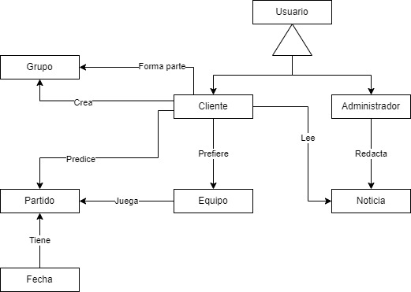
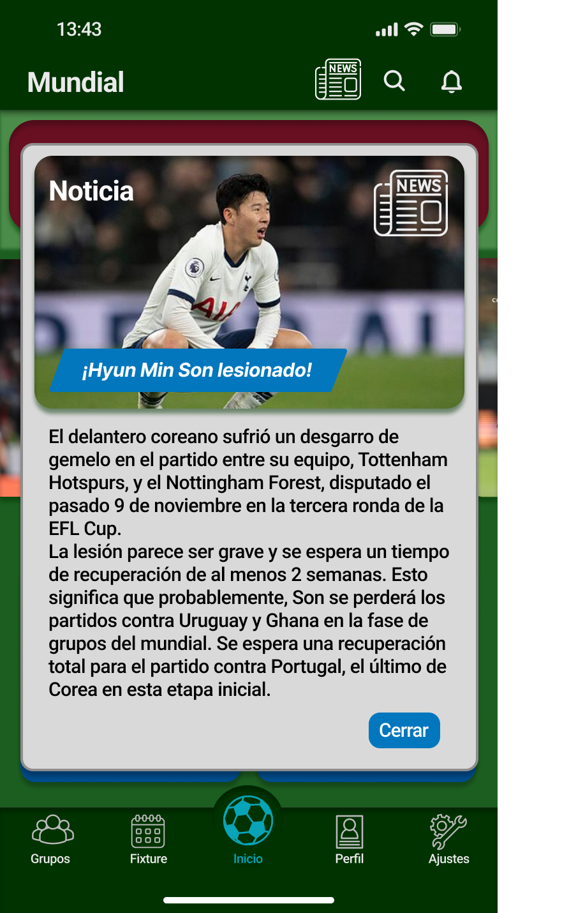
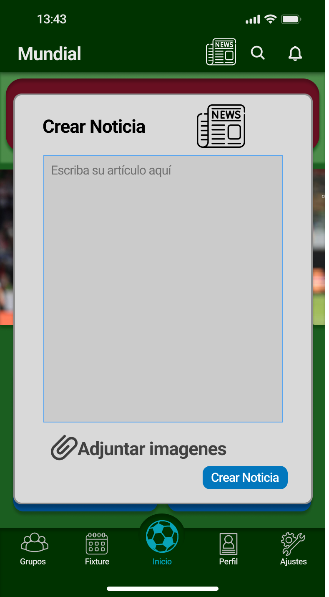
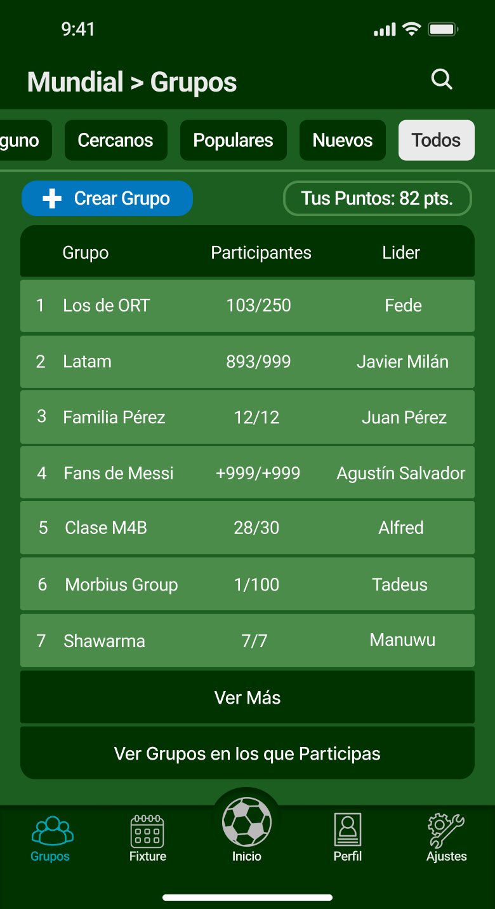
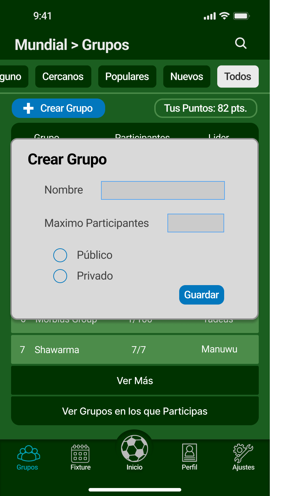
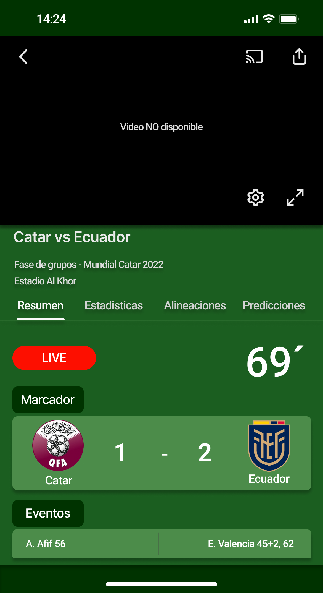
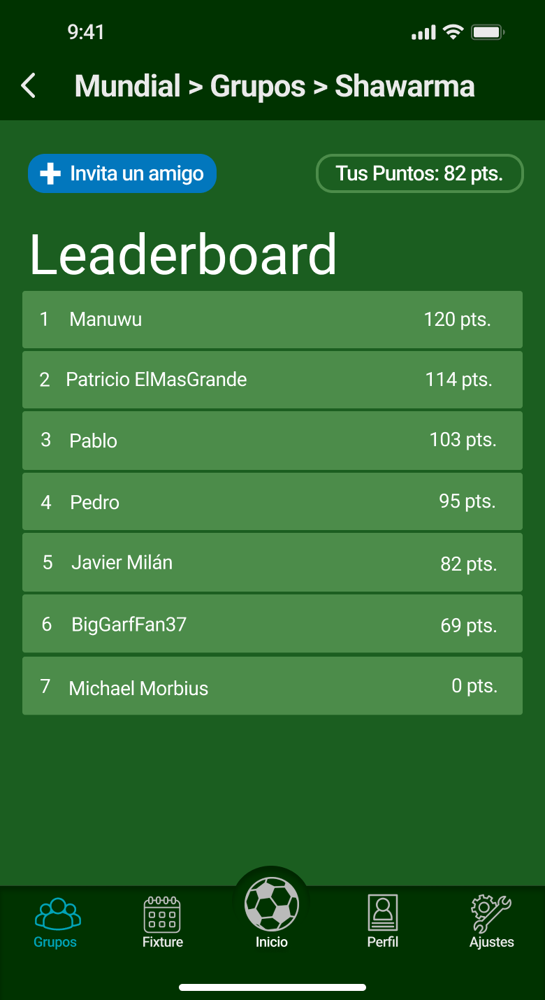

# Informe académico entrega 1

Fecha de entrega: 03-oct-2022

## Glosario

- Fixture: Muestra fecha y hora de los partidos jugados y que se están por jugar, el resultado de los partidos jugados y el minuto a minuto de los partidos que se están jugando en el momento.
- Minuto a Minuto: Texto indicando las situaciones importantes sucedidas en el partido actualizado en vivo e indicando en el minuto sucedido.
- Highlights: Un vídeo corto (máximo 10 minutos) con los goles, expulsiones, faltas importantes y situaciones de peligro sucedidas en un partido.
- Penca: Actividad de predecir los resultados de los partidos de un torneo en un grupo con un sistema de puntos y una leaderboard. Según el grado de precisión de la predicción, se ganarán más o menos puntos.
- Grupo: Un conjunto de personas compitiendo en la penca.
- Predicción: Indicar el resultado esperado de un partido antes de que suceda.
- Apuesta: Invertir una cantidad X de una moneda en una predicción, en caso de que se esté equivocado se pierde la cantidad invertida, en caso de acertar se gana con respecto a un porcentaje. A veces se usa como sinónimo de predicción.
- Leaderboard: Una tabla de integrantes de un grupo ordenada en función de la cantidad de puntos de cada uno.
- Dashboard: Usamos el termino como sinónimo de Leaderboard.
- Plantillas: 11 seleccionados, suplentes y cambios hechos en un equipo.
- Predicciones de Situaciones Objetivas: Predicción de una situación comprobable dentro de un partido.
- Perfil: Conjunto de datos que definen a un usuario.
- Notificación: Popup que aparece sin necesidad de tener la aplicación abierta para informar de algo.
- Noticia: Un resumen de un suceso importante.

## Repositorio Git

### Creación y uso de repositorios locales y remotos

Para iniciar a trabajar en Git es necesario la creación de un repositorio local y remoto. Al inicializar el git estaremos creando un repositorio local en el que trabajar en nuestra computadora.

Los archivos creados en este repositorio local se encontrarán en la “working area” (si nos fijamos en el estado del git no nos aparecerá ningún archivo). Aquí es donde trabajaremos en los archivos y haremos las modificaciones necesarias. 

Luego, al terminar de trabajar en el archivo lo pasaremos a la “staging area” (en el estado del git se encontrará el nombre del archivo en rojo). Aquí es donde estarán los archivos prontos para hacer el commit. Por ultimo, se confirma el commit (en el estado del git se encontrará el nombre del archivo en verde).

Para subir nuestros cambios a la nube debemos tener un repositorio remoto. Para crearlo se requiere entrar en [GitHub](https://github.com/). Aquí seleccionaremos la opción “create a new repository”, se llenan los campos obligatorios y selecciona el botón verde “create repository”. Una vez creado el repositorio remoto será necesario enlazar el repositorio local con el mismo para poder subir los cambios.

Todos los comandos fundamentales para realizar las acciones recién detalladas se encuentran en el Anexo1 (ver referencias).

### Comandos Git ejecutados desde terminal y desde el IDE

- Configuración de la información del usuario utilizada en todos los repositorios locales
    - `git config --global user.name “<nombre apellido>”` → Establece un nombre que sea identificable para cuando se revise el historial de versiones.
    - `git config --global user.email “<email>”` → Establece una dirección de correo electrónico.
- Inicialización y clonación de repositorios
    - `git init` → Inicializa un directorio existente como repositorio Git.
    - `git clone <url>` → Clona un repositorio desde una ubicación alojada a través de una URL.
- Trabajar con snapshots y el área de preparación de Git
    - `git status` → Muestra el estado del repositorio local y los archivos, es decir, si fueron modificados, eliminados, agregados o si está al día.
    - `git add <archivo>` → Agrega un archivo a la etapa del “staging area”.
    - `git reset <archivo>` → Quita el archivo de la etapa del “staging area”.
    - `git diff` → Muestra los cambios pero de lo que NO está en la “staging area”.
    - `git diff --staged` → Muestra los cambios pero de lo que está en la “staging area”.
    - `git commit -m "<mensaje descriptivo>"` → Confirma y prepara los cambios que se hicieron para subirlos al repositorio remoto.
    - `git push` → Sube los archivos de la staging area al repositorio remoto.
- Utilizar ramas, cambiar el contexto e integrar los cambios
    - `git branch` → Muestra las ramas existentes.
    - `git branch <nombre de la rama>` → Crea la rama con el nombre escrito.
    - `git checkout` → Se mueve de branch.
    - `git merge <rama>` → Junta la rama en la cual nos encontramos con la rama escrita.
- Examinar los registros, los diffs y la información de los objetos
    - `git log` → Muestra el historial de comandos.
    - `git log branchB..branchA` → Muestra los commits de la ramaA que no están en la ramaB.
    - `git log --follow <archivo>` → Muestra los commits que cambiaron el archivo, incluso a través de los renombramientos.
    - `git diff branchB...branchA` → Muestra la diferencia de lo que está en la ramaA que no está en la ramaB.
    - `git show <SHA>` → Muestra cualquier objeto en Git en formato legible para el ser humano.
- Recuperación de las actualizaciones de otro repositorio y actualización de los repos locales
    - `git remote add <alias> <url>` → Añade una URL de git como alias.
    - `git fetch <alias o url>` → Obtiene todas las ramas del Git remoto.
    - `git pull` → Obtiene y fusiona los commits del repositorio remoto, con el local.
- Versionar las eliminaciones de archivos y los cambios de ruta
    - `git rm <archivo>` → Elimina el archivo del proyecto y prepara la eliminación para el siguiente commit.
    - `git mv <ruta existente> <nueva ruta>` → Renombra y/o cambia la ruta un archivo existente.
    - `git log --stat -M` → Muestra todos los registros de commit con indicación de las rutas que se han movido.
- Reescribir ramas, actualizar commits y borrar el historial
    - `git rebase <rama>` → Aplica cualquier commit de la rama actual por delante de la especificada.
    - `git reset --hard <commit>` → Despeja el área de preparación, reescribe el árbol de trabajo desde el commit especificado.

## Versionado

### Buenas prácticas de versionado

Para poder llevar un control del versionado de manera prolija, se usara Git como herramienta. Así mismo, se hará uso de GitHub para tener acceso a un repositorio remoto, haciendo que todos los miembros del equipo, así como los profesores, tengan acceso para modificar y ver el progreso.

Los commits realizados llevarán un formato específico. Esto los hace más entendibles y mnemotécnicos. Las reglas a seguir serán las del “conventional commit” (ver Anexo2). En otras palabras, se implementaran commits con nombre de la forma <TIPO>: Descripción. El tipo podrá ser uno de dos: add, para cuando se trate de una nueva funcionalidad; o fix, si es un commit que arregla un error o bug antes presente. Cabe destacar que no usamos todas las reglas propuestas de conventional commit y que usamos solo las que nos resultan más pertinentes.

También se seguirán ciertas reglas para las ramas, que serán explicadas a continuación.

### Uso de ramas separadas de 'main'

Para asegurar el correcto funcionamiento del producto, se trabajaran con múltiples ramas. Al implementar sobre nuestra versión estable nuevas funcionalidades, estas deberán pasar por un proceso de construcción, prueba y optimización, con el objetivo de llegar al mejor producto final posible. Debido a esto, se usan distintas ramas de desarrollo para poder llevar las distintas versiones de manera prolija y entendible. 

La rama principal es la “main”, en la que se llevaran todas las versiones estables. Al iniciar el desarrollo de una nueva función, se creará una nueva rama saliente de main, la rama “develop” (que llamamos v0.1 para esta primera entrega), en la que iremos archivando las versiones de desarrollo. 

Esta rama dev podría generar otras ramas a la hora de implementar varias funcionalidades. Esto no tiene porqué suceder, pero podría darse el caso. Principalmente, podríamos ver dos tipos distintos de rama de dev: 1) La rama de feature, en la que se desarrolla una función específica del sistema. Una vez terminado el desarrollo de esta función, esta rama se integra a develop. 2) La rama release es aquella que sale de develop y se crea al acercarse a una versión estable. Se usa para corregir bugs y desarrollar la documentación. Una vez finalizado, se integra con la main.

Al llegar a una nueva versión estable en la rama develop, esta se integra con la main. De esta manera, se logra tener un espacio de trabajo en la rama develop, mientras que la última versión estable estará siempre al alcance, como el último commit de la rama main. 

## Elicitación

### Evidencia de actividades de investigación

**Lluvia de ideas**

- Mostrar fecha y hora de los partidos (próximos y pasados)
- Noticias y predicciones (porcentajes de probabilidad de victoria de un equipo según lo que opinan los usuarios)
- Funciones de penca
- Grupos públicos y privados
- Elección de equipos favoritos
- Mostrar resultados y resúmenes en vivo
- Mostrar el porcentaje de usuarios que predijo cada resultado
- Apuestas
- Chat
- Anuncios
- Predicciones estilo SuperDT para puntos extra

**Ingeniería inversa**

Se tomaron apps de noticias de fútbol y pencas que pueden servir como inspiración para nuestro proyecto. Las apps en cuestión son OneFootball, Forza, PencaOvaciónMovistar y Penca del Mundial Claro.

OneFootball

Es una de las aplicaciones de fútbol más usadas ya que es de las más completas disponibles en el mercado. Permite seleccionar los equipos y ligas favoritos de cada usuario, brindando notificaciones más personalizadas, función que vemos muy beneficiosa. Brinda también la información pertinente de cada partido, como su fecha, horario, plantillas, resumen, resultado en vivo y estadísticas. Este último punto es fundamental y será muy usado en nuestro proyecto.

Forza Football

Otra app analizada es Forza Football, que tiene varias de las mismas funciones que OneFootball. Una función interesante es poder puntuar a los jugadores tras el partido, así como crear la que sería la formación ideal del usuario. Además se conecta directamente con casas de apuesta tales como Bet365, para realizar apuestas desde la app. Esta última función es interesante, pero no parece ser útil para nuestro proyecto.

PencaOvaciónMovistar

Es la principal aplicación de penca en la que nos basamos. El usuario puede formar parte de torneos con grupos públicos o privados, pudiendo importar los resultados de los partidos que ya predijo en otros grupos. A la hora de poner la predicción, se muestra el porcentaje de usuarios que predijo cada resultado, además de los datos generales del partido.

Penca del Mundial Claro

Esta aplicación de penca fue realizada por Guillermo Varela, licenciado en sistemas al que entrevistamos. Él nos facilitó mucha información de su proyecto, así como imágenes y prototipos que usaremos como guía. En general, las ideas que podríamos adaptar a nuestro sistema es implementar grupos públicos con influencers, ex-jugadores y periodistas reconocidos para viralizar la aplicación; intentar generar un sistema de puntos que incentive la participación, aunque se introduzca al juego de manera tardía; y poder crear grupos privados e invitar a gente a través de un código único.

**Entrevistas**

Se llevó a cabo una entrevista (que identificaremos como ENT01) con Guillermo Varela, consejero del Club Atlético Peñarol y licenciado en sistemas. La entrevista, que duró al rededor de una hora, fue de gran utilidad, ya que el entrevistado es un gran fanático, no solo del fútbol, sino que también de las pencas. Adicionalmente, como programador, tiene experiencia trabajando con aplicaciones de este estilo. La entrevista se preparó con una serie de preguntas a ser usadas como guía, haciendo preguntas adicionales que surgieron en el momento.

Lo que aprendimos de esta entrevista es que Guillermo participa en muchas pencas, y lo hace con compañeros de trabajo, medios, desconocidos, y con gente tanto uruguaya como extranjera. Disfruta la competencia de las pencas, y no le gusta lo poco competitivo que se puede volver entrar de manera tardía a una penca. No obstante, nunca participa en pencas por apostar, aunque si está dispuesto a pagar cierto monto para participar. En cuanto a los anuncios, el cree que anuncios creativos, relacionados a la aplicación, o pop ups cortos son aceptables.

Volviendo a la competitividad, él lo pone como algo fundamental del sistema. Una manera de conseguirla siempre puede ser hacer 2 tablas. Por un lado, establecer un dashboard tradicional, con los usuarios rankeados por los puntos que ganaron por sus predicciones. Por otro lado, se tiene otra tabla en la que se permite apostar los puntos que se tienen, dándole al juego más capas de competitividad. Sobre el tema de las tablas de ranking, él lo ve como un elemento fundamental de la penca, junto con la facilidad para proponer resultados.

Comentó que ve la penca como un juego de intuición y que no se debería poder cambiar el resultado una vez comienza el partido. Está de acuerdo con el resto de reglas clásicas. Asimismo, las predicciones del resto de jugadores debe mostrarse únicamente después de terminado el partido, pero si se pueden mostrar antes en forma de porcentajes y de manera anónima (ya que si se muestra quien lo realizo puede ser injusto). 

Para implementar un sistema nuevo, se nos ocurrió hacer una penca basada en el desempeño de los jugadores, al estilo ElSuperDT. Al presentarle esta idea, Guillermo dijo que le parece una buena idea si se usan fuentes objetivas, formales y empíricas para los puntajes. También propone hacer que los usuarios ganen más puntos si, por ejemplo, predicen que va a haber un gol desde afuera del área, o si adivinan quien mete gol. Lo importante, es que estos objetivos sean empíricos y comprobables para que sea justo. Por ejemplo, apostar por quien va a ser el mejor jugador del partido no es conveniente, ya que el mejor es subjetivo.

En cuanto a otras funciones, mencionó que lo que él cree que le falta a Forza (app de fútbol que él usa primariamente) es incluir highlights de los partidos. Cree también que el chat es poco recomendable, ya que los usuarios usarán otras redes para comunicarse y la implementación puede ser complicada. Los datos brindados por la app en relación al partido deben ser principalmente los relacionados con la penca, no los datos que los usuarios podrían buscar en internet (obviamente los datos como la fecha, hora y estadio del partido deben estar, pero las plantillas, el arbitro, etc. simplemente cargaran la app).

La aplicación debe notificar antes de un partido a todos los miembros del grupo, para que nadie pierda puntos por olvidar votar. Además, se deben poder marcar partidos próximos como favoritos para que se guarden en aplicaciones como Google Calendar y que notifique al usuario cuando comience. La app también puede vincularse a otras redes sociales como Facebook, Twitter e Instagram para publicar los resultados y las posiciones y generar más interacción entre usuarios, así como publicidad.

Finalmente, en el aspecto estético, Guillermo recomendó un diseño minimalista con pocos elementos por página para que sea más entendible. Los botones deberán ser grandes para que sea más sencillo de usar. También recomendó usar imágenes genéricas que no sean propiedad de la FIFA, ya que puede haber complicaciones.

### Referencias a fuentes de información

- OneFootball: [https://onefootball.com/es/inicio](https://onefootball.com/es/inicio)
- Forza Football: [https://forzafootball.com/es](https://forzafootball.com/es)
- Penca Ovación Movistar: [https://play.google.com/store/apps/details?id=com.futbolx.pencaapp.ovacion&hl=es_UY&gl=US](https://play.google.com/store/apps/details?id=com.futbolx.pencaapp.ovacion&hl=es_UY&gl=US)
- ElSuperDT: [https://www.elsuperdt.com/](https://www.elsuperdt.com/)
- Guillermo Varela: [https://uy.linkedin.com/in/guillermovarelauruguay](https://uy.linkedin.com/in/guillermovarelauruguay)

### Caracterización de usuarios: User Personas

### Modelo conceptual del problema

## Especificación

### Definición de requerimientos funcionales y no funcionales

**Referencias de prioridad:** 

Para definir la prioridad de cada requerimiento, nos basamos en la siguiente escala (ordenada de más a menos prioritario):

1) Muy alta

2) Alta

3) Media-Alta

4) Media

5) Media-Baja

6) Baja

### Requerimientos funcionales

- RF1: Calendario de Partidos
    
    Actor: Usuario
    
    Descripción: Muestra fecha y hora de los partidos jugados y que se están por jugar, el resultado de los partidos jugados y el minuto a minuto de los partidos que se están jugando en el momento.
    
    Prioridad: Muy alta
    
    Referencia: Lluvia de ideas
    
- RF2: Noticias
    
    Actor: Usuario
    
    Descripción: Está disponible una pestaña de noticias e información relevante con respecto a los próximos partidos y otras eventualidades relevantes.
    
    Prioridad: Media 
    
    Referencia: Lluvia de ideas
    

- RF3: Predicción de partidos

    Actor: Usuario

    Descripción: La posibilidad de competir por puntos prediciendo el resultado de los próximos partidos, tanto con conocidos (en grupos privados) como con desconocidos en (grupos públicos).
    
    Prioridad: Alta
    
    Referencia: Lluvia de ideas
    
- RF4: Ver predicciones
    
    Actor: Usuario
    
    Descripción: Una gráfica con el porcentaje de las opiniones generales de las personas (pertenecientes al grupo o no) con respecto al partido. Por ejemplo, equipo A gana, empata o pierde y el porcentaje de selección de cada opción.
    
    Prioridad: Media-Baja
    
    Referencia: Lluvia de ideas
    
- RF5: Apuestas de Puntos
    
    Actor: Usuario
    
    Descripción: Aparte de la penca tradicional, la posibilidad de apostar los puntos conseguidos. Esto hace que los usuarios que entren tarde tengan posibilidad de alcanzar a los usuarios con muchos puntos ya conseguidos. Aplican restricciones de apuesta para que nadie se vuelva inalcanzable (por ejemplo, que no se puedan apostar todos los puntos disponibles).
    
    Prioridad: Media-Baja
    
    Referencia: ENT01
    

- RF6: Predicciones del Grupo
    
    Actor: Usuario
    
    Descripción: Permitir ver el porcentaje de predicciones del grupo perteneciente a la penca de forma anónima antes del partido, y los autores de las predicciones luego de haber cerrado la posibilidad de cambios.
    
    Prioridad: Media-Baja
    
    Referencia: ENT01 e Ingeniería Inversa
    
- RF7: Predicciones de Situaciones Objetivas en los Partidos
    
    Actor: Usuario
    
    Descripción: La posibilidad de predecir situaciones especificas de los partidos para que haya posibilidad de ganar puntos extra. Por ejemplo, si el usuario ingresó 1-0 como predicción, la predicción extra puede ser si el gol es fuera o dentro del área. También podría ser cuantos tiros de esquina tuvo cada cuadro, que jugador metió cada gol, etc. 
    
    Prioridad: Media-Baja
    
    Referencia: ENT01 y lluvia de ideas
    
- RF8: Higlights de los Partidos
    
    Actor: Usuario
    
    Descripción: Vínculos a vídeos de aproximadamente 10 minutos, en los cuales, una vez terminado el partido, se muestran los momentos mas importantes de los mismos.
    
    Prioridad: Media-Alta
    
    Referencia: ENT01
    
- RF9: Guardar en calendar
    
    Actor: Usuario
    
    Descripción: La posibilidad de vincular la app con Google Calendar para agregar a la misma los partidos que uno desee.
    
    Prioridad: Media
    
    Referencia: ENT01
    
- RF10: Notificación por Penca
    
    Actor: Usuario
    
    Descripción: Notificar a aquellos usuarios que se encuentran dentro de un grupo de penca y no han puesto la predicción de partidos que empiezan en poco tiempo.
    
    Prioridad: Media-Baja
    
    Referencia: ENT01
    
- RF11: Compartir
    
    Actor: Usuario
    
    Descripción: Poder compartir los grupos de penca y los resultados de las predicciones en redes sociales.
    
    Prioridad: Media
    
    Referencia: ENT01
    
- RF12: Grupos
    
    Actor: Usuario
    
    Descripción: Tener la habilidad de crear grupos de penca públicos y privados.
    
    Prioridad: Muy Alta
    
    Referencia: Lluvia de ideas, Ingeniería inversa y ENT01
    
- RF13: Escribir noticias
    
    Actor: Administrador
    
    Descripción: El administrador debe poder redactar noticias para publicar en la app.
    
    Prioridad: Alta
    
    Referencia: Lluvia de ideas
    
- RF14: Selección de equipo favorito
    
    Actor: Usuario
    
    Descripción: Se pude elegir un equipo favorito para enseñarlo en el perfil y recibir notificaciones personalizadas.
    
    Prioridad: Media
    
    Referencia: Lluvia de ideas e Ingeniería inversa
    

### Requerimientos no funcionales

- RNF1: Fuente
    
    Descripción: Utilizar la tipografía Roboto para la letra.
    
    Prioridad: Alta
    
- RNF2: Colores
    
    Descripción: La paleta de colores debe consistir de green 900 como color principal y de light blue 800 como color secundario.
    
    Prioridad: Alta
    
- RNF3: Iconos
    
    Descripción: Los iconos deben ser en formato filled.
    
    Prioridad: Media
    
- RNF4: Imágenes genéricas
    
    Descripción: Se deberán usar imágenes de uso libre para evitar complicaciones.
    
    Prioridad: Media
    
    Referencia: ENT01 
    
- RNF5: Minuto a minuto en vivo
    
    Descripción: El minuto a minuto del partido debería de actualizarse en vivo (con un retardo de menos de 2 minutos) para agregar los eventos a medida que sucedan.
    
    Prioridad: Media-Baja
    
    Referencia: Lluvia de Ideas
    
- RNF6: Diseño minimalista
    
    Descripción: Un máximo de 6 botones por pantalla para que la aplicación sea sencilla para todo el mundo.
    
    Prioridad: Media
    
    Referencia: ENT01
    
- RNF7: Botones grandes
    
    Descripción: Los botones pertenecientes al menú deberían ocupar todo el ancho y 1/10 del alto de la pantalla.
    
    Prioridad: Media
    
    Referencia: ENT01
    
- RNF8: Disponibilidad
    
    Descripción: La aplicación debe estar disponible para iOS 14 y posteriores, así como para Android 5.0 y posteriores.
    
    Prioridad: Alta
    
    Referencia: ENT01
    

### User Stories

**US: #1**

Titulo: Crear grupo

Narrativa: 

Como jugador de penca quiero crear un grupo para jugar con otras personas.

Criterios de aceptación:

- Se debe indicar si será un grupo privado o público.
    - En caso de ser privado, los usuarios invitados deben tener cuenta.
- El grupo debe tener un nombre único.
- Se debe definir una cantidad máxima de jugadores, que luego puede ser modificada.

**US: #2**

Titulo: Enviar predicción

Narrativa: 

Como jugador de penca quiero introducir mi predicción para un partido, buscando ganar puntos y subir de posición en mis competiciones.

Criterios de aceptación:

- El resultado debe constar de 2 números, la cantidad de goles marcados por cada equipo.
- La predicción deberá hacerse antes de que comience el partido.
- Este resultado se aplicará como predicción de todos los grupos.

**US: #3**

Titulo: Seleccionar equipo favorito

Narrativa: 

Como fanático, quiero seleccionar el equipo que apoyo para que se me notifiquen las noticias y resultados de ese equipo.

Criterios de aceptación:

- El equipo seleccionado debe ser la selección de uno de los 32 países participantes del mundial.

Nota: Se mostrará la bandera del país seleccionado en la esquina superior derecha de la carta del perfil del usuario.

**US: #4**

Titulo: Ver puntaje de un grupo

Narrativa: 

Como jugador, quiero ver la tabla de puntajes de un grupo para ver quien va ganando. 

Criterios de aceptación:

- El grupo seleccionado debe existir. Si se busca un grupo inexistente, el sistema deberá advertirlo.
- En caso de ser un grupo privado, el usuario debe formar parte de él para acceder a la leaderboard.

**US: #5**

Titulo: Ver highlights

Narrativa: 

Como fanático quiero ver los mejores momentos de un partido para no perderme nada del torneo.

Criterios de aceptación:

- El partido debe haber terminado para poder tener disponible el resumen.

**US: #6**

Titulo: Ver perfil

Narrativa: 

Como usuario, quiero ver el perfil de otro jugador para conocer los datos y puntajes de otra gente.

Criterios de aceptación:

- El usuario debe existir. No puedo ver perfil de un usuario inexistente.

**US: #7**

Titulo: Establecer notificaciones

Narrativa: 

Como fanático, quiero recibir notificaciones de un partido especifico (goles, inicio, fin, lesiones, etc.) para poder seguirlo en vivo.

Criterios de aceptación:

- El partido no debe haber terminado aún.
- El usuario tiene que vincular (si no lo ha hecho ya) una aplicación de calendario (como Google Calendar, por ejemplo) para recibir las notificaciones.

**US: #8**

Titulo: Leer noticias

Narrativa: 

Como usuario, quiero ver las noticias disponibles para mantenerme al tanto de todo lo relacionado con el torneo.

Criterios de aceptación:

- El usuario debe tener definido un equipo favorito para recibir noticias personalizadas. De lo contrario, recibirá todas las noticias del torneo, sin filtrarse por equipo.

### Use Cases detallados

Nota: Los bocetos de interfaz de usuario se explican tras los casos de uso.

**UC #1**

Título: Leer una noticia

Requerimientos: RF2

Actor: Usuario

Precondición: -

Curso:

| Acción de los actores | Respuesta del sistema |
| --- | --- |
| 1. Se selecciona la noticia deseada de las disponibles | 2. Muestra toda la noticia, incluyendo las fuentes, información e imágenes. |

Poscondición:  -

Cursos alternativos:

1.1: Si no hay noticias disponibles, no se muestra ninguna. Fin del caso de uso.

 

**UC #2**

Título: Escribir una noticia

Requerimientos: RF13

Actor: Administrador

Precondición: -

Curso:

| Acción de los actores | Respuesta del sistema |
| --- | --- |
| 1. El usuario selecciona la opción para redactar noticia | 2. Se despliega un panel para escribir texto e insertar imágenes  |
| 3. Una vez ha terminado, el usuario selecciona un título, guarda los cambios y los sube | 4. Se confirma que la noticia se publicó con éxito |

Poscondición: Se muestra la noticia entre las disponibles.

Cursos alternativos:

1.1: Si el usuario no es administrador, no se muestra la opción de redactar noticia. Fin de caso de uso.

4.1: Si por alguna razón existe algún problema a la hora de subir, se notifica y reporta el fallo. La noticia redactada se guarda como un borrador.

     

**UC #3**

Título: Crear un grupo

Requerimientos: RF12

Actor: Usuario

Precondición: -

Curso:

| Acción de los actores | Respuesta del sistema |
| --- | --- |
| 1. Selecciona el menú de grupos | 2. Se muestra el menú de los grupos |
| 3. Selecciona la opción crear grupo | 4. Se despliega un pop up con campos para llenar |
| 5. El usuario rellena los campos requeridos y le da a aceptar  | 6. Se notifica que el grupo se creó, mostrando los datos del grupo |

Poscondición: Se muestra el grupo en la lista de grupos. Además, se muestra entre los grupos a los que pertenece el usuario.

Cursos alternativos: 

5.1: En caso de que el nombre del grupo ya existe, le pide al usuario ingresar un nombre distinto.

     

**UC #4**

Título: Ingresar una predicción

Requerimientos: RF3

Actor: Usuario

Precondición: Debe existir algún partido pendiente

Curso:

| Acción de los actores | Respuesta del sistema |
| --- | --- |
| 1. Selecciona el menú de calendario de partidos | 2. Se despliegan los partidos por jugar, los partidos en vivo y los resultados de los partidos ya jugados |
| 3. El usuario selecciona un partido que aun no dio comienzo | 4. Se muestran los datos del partido seleccionado |
| 5. El usuario indica su resultado | 6. Se notifica que la predicción se guardó con éxito |

Poscondición: La predicción queda registrada en el sistema y se muestra para el usuario que la hizo.

Cursos alternativos:

3.1: Si no hay partidos por jugar, no puede predecir ninguno. Fin del caso de uso.

5.1: Si el resultado no es válido (tiene valores negativos o letras), se pide reingresar.

     

**UC #5**

Título: Editar Perfil

Requerimientos: RF14

Actor: Usuario

Precondición: -

Curso:

| Acción de los actores | Respuesta del sistema |
| --- | --- |
| 1. El usuario accede a su perfil | 2. Se despliega el perfil del usuario |
| 3. Selecciona la opción para editar perfil | 4. Se despliegan los campos con posibilidad de cambio |
| 5. El usuario rellena los campos y los guarda | 6. El sistema registra los cambios y edita el perfil |

Poscondición: Los datos del usuario se actualizan, mostrando su nueva carta de perfil.

Cursos alternativos: 

5.1: Si el username seleccionado ya está en uso, se pide el ingreso de otro nuevo.

     

**UC #6**

Título: Ver minuto a minuto

Requerimientos: RNF5

Actor: Usuario

Precondición: El partido se está jugando

Curso:

| Acción de los actores | Respuesta del sistema |
| --- | --- |
| 1. Selecciona el menú de calendario de partidos | 2. Se despliegan los partidos por jugar, los partidos en curso y los resultados de los partidos ya jugados |
| 3. El usuario selecciona un partido en curso | 4. Se despliegan los datos del partido, donde encontramos los eventos con el minuto a minuto |

Poscondición: Se muestran los eventos, actualizándose de manera periódica para mantenerse coherentes con el resultado en vivo.

Cursos alternativos:

3.1: No hay partidos en curso, fin del caso de uso.

     

**UC #7**

Título: Invitar a otros usuarios a un grupo

Requerimientos: RF12

Actor: Usuario

Precondición: El grupo no debe estar lleno

Curso:

| Acción de los actores | Respuesta del sistema |
| --- | --- |
| 1.  Selecciona la sección de grupos | 2. Se muestran los grupos disponibles |
| 3. Se selecciona el grupo deseado | 4. Se abre el detalle del grupo |
| 5. Se selecciona la opción de invitación | 6. El sistema provee un link para que el usuario comparta con los invitados  |
| 7. El invitado accede al link | 8. El sistema agrega al invitado al grupo |

Poscondición: Los usuarios quedan registrados como miembros del grupo.

Cursos alternativos:

2.1: Si no hay grupos disponibles no se muestra ninguno. Fin caso de uso.

5.1: Opción solo disponible si es un grupo público o el usuario es el creador del grupo privado.

8.1: Si el grupo está lleno, no se agrega al invitado y se notifica del error.

     

**UC #8**

Título: Activar notificaciones de un partido

Requerimientos: RF9

Actor: Usuario

Precondición: -

Curso:

| Acción de los actores | Respuesta del sistema |
| --- | --- |
| 1. Selecciona el menú de calendario de partidos | 2. Se despliegan los partidos por jugar, los partidos en vivo y los resultados de los partidos ya jugados |
| 3. Selecciona la opción para recibir notificaciones en el partido deseado | 4. El símbolo de notificación cambiará de color para ese partido, mostrando que se activó  |

Poscondición: Se le notificará de todos los eventos del partido al usuario, a través de notificaciones de la aplicación. Además, se agendará el partido en cualquier aplicación de calendario que el usuario tenga vincualda a su cuenta. 

Cursos alternativos:

3.1: Si el partido ya terminó, no se encontrará la opción para activar notificaciones.

     

**UC #9**

Título: Buscar un partido

Requerimientos: RF1

Actor: Usuario

Precondición: -

Curso:

| Acción de los actores | Respuesta del sistema |
| --- | --- |
| 1. Selecciona el menú de calendario de partidos | 2.  Se despliegan los partidos por jugar, los partidos en vivo y los resultados de los partidos ya jugados |
| 3. Selecciona la opción de buscar | 4. Le permite al usuario escribir |
| 5. El usuario ingresa una fecha o un nombre de un equipo | 6. Se le muestran los resultados que coinciden con la búsqueda |

Poscondición: Se le ofrecen al usuario todos los partidos coincidentes.

Cursos alternativos:

6.1: Si ningún partido coincide, se muestra que no hay coincidencias.

### Bocetos de IU

Las siguientes imágenes buscan ejemplificar como se vería la aplicación en sistemas móviles.  Fueron realizadas con la herramienta Figma.

- Figura 1: Pantalla inicial de la interfaz de usuario, contiene sponsors, próximos partidos y permite deslizar entre las noticias.
  
- Figura 2: PopUp que aparece al seleccionar una noticia en la pantalla de inicio. Muestra toda la noticia, incluyendo las fuentes, información e imágenes.
  
- Figura 3: PopUp para crear noticia. Este tiene un campo de texto y una opción para adjuntar imágenes. Solo los usuarios adminitradores poseen un botón en la pantalla de inicio para crear noticias. 
  
- Figura 4: Al seleccionar un partido se pueden ver los detalles del mismo (si el partido aún no termina se mostrará los detalles obtenidos hasta el momento del partido). Para ir a esta pantalla se debe seleccionar el partido desde los cuadros para predecir o desde la pantalla del fixture.
      
- Figura 5: Al seleccionar un partido, desde los cuadros para predecir o desde la pantalla del fixture. Yendo a la pestaña de “Predicciones”, se pueden realizar apuestas. 
  
- Figura 6: Seleccionar la opción de “Ver Más” de la pantalla de inicio, lleva a una lista de todas los partidos que se jugarán.
  
- Figura 7: La pantalla de Fixture lleva a una lista de los partidos que se jugaron, se están jugando o se jugarán. Cada partido posee un botón que permite activar una notificación que alertará todo sobre el partido.
  
- Figura 8: Pantalla de Perfil, muestra diferente información del usuario y sus puntos. Hay 2 botones extra para editar el perfil y otro para leer los términos y condiciones de la aplicación. Cabe destacar que el peso y la altura son datos no necesarios, que se agregaron solo para asemejarse más a una figurita del álbum del Qatar 2022 de Panini (decisión meramente estética).
  
- Figura 9: PopUp para editar perfil, en este se puede configurar el nombre del usuario, fecha de nacimiento, equipo favorito y como añadido, el peso y la altura para asemejarse a una figurita del álbum del Qatar 2022 de Panini.
  
- Figura 10: La pantalla de Grupos contiene grupos públicos, así como privados creados por los usuarios para poder realizar apuestas entre ellos. Esta pantalla también tiene filtros que ayudan a la búsqueda de estos grupos y una opción para crear tus propios grupos. 
  
- Figura 11: Pantalla para ver los detalles del grupo, estos muestran la Leaderboard (tabla de posiciones) y agrega un botón para invitar amigos. Para llegar a esta ventana se debe seleccionar un grupo desde la pantalla de grupos.
  
- Figura 12: PopUp para crear grupos, dentro de este se puede asignar un nombre al grupo y determinar la cantidad de participantes y si es público o privado.
  

## Validación y verificación

### Verificar la especificación

La verificación se hará viendo si los requerimientos establecidos fueron aplicados y si cumplen ciertas características. Vemos que todos los requerimientos son específicos y no dejan lugar a ambigüedades. También todos ellos son verificables y trazables, ya que es sencillo ver si se implementaron y cuando se hizo. Además, permiten posibilidad de modificación, para el caso en el que se desee implementar cambios en el futuro.

En cuanto a la implementación, en este prototipo se introdujeron todos los requerimientos de prioridad más alta. No se implementaron todos los especificados, pero si los de mayor relevancia.

### Validar la solución con personas no involucradas en el proyecto

Para validar la solución se enseño el boceto de la interfaz a diferentes personas no relacionadas con el proyecto, en búsqueda opiniones sobre este. Surgieron dos sugerencias para el futuro. Por un lado, se propuso representar los partidos de manera diferente, siguiendo la estructura tradicional de fixture, no tanto de pencas, como se uso en este primer acercamiento. Los partidos se representarían según los grupos y, posteriormente, según el árbol de enfrentamientos. Ver imagen de referencia:

 

La otra sugerencia fue poner las noticias en una pestaña aparte, haciendo que sea más sencillo acceder a ellas.

No obstante, los usuarios estuvieron contentos con el resultado final. Lo veían llamativo y bonito estéticamente, además de intuitivo y prolijo, de fácil uso.

## Reflexión

### Detalle del trabajo individual

Alfredo Fernández

Con respecto a este obligatorio he de decir que me gusto que sea la forma de organizarse antes de comenzar con la programación, me parece muy útil para que los proyectos avancen como debería.

En nuestro obligatorio, la entrevista fue muy fructífera y creo que cada uno del grupo fue fundamental para el resultado del mismo.

Por mi parte, estoy muy satisfecho con la entrega.

Tadeo Goday

Fue un trabajo divertido e interesante, considero que este nos enseñó a organizarnos para avanzar en un proyecto. Todos tuvimos un gran desempeño y una coordinación casi impecable.

Creo que todos quedamos muy contentos con lo útil que fue la entrevista y con los bocetos que logramos.

Considero que tengo un muy buen equipo que supo organizarse para llegar a los resultados que obtuvimos.

Manuel Morandi

Este trabajo fue muy interesante. Se nos dio una libertad a la hora de organizarnos y preparar la entrega que no habíamos tenido hasta el momento. Considero que el producto final fue bastante bueno, y que estuvimos bien organizados y preparados a lo largo de todo el proceso. Los bocetos resultaron mucho mejores de lo que creíamos y las técnicas de elicitación aplicadas fueron productivas y beneficiosas, en especial la entrevista, que supero ampliamente mis expectativas. 

Estoy muy contento con el resultado al que llegamos con mis compañeros.

### Técnicas aplicadas y aprendizajes

Creemos que las técnicas utilizadas fueron elegidas correctamente, ya que todas dieron buenos resultados. Gracias a las conclusiones dejadas por la ingeniería inversa y la lluvia de ideas que se realizaron en etapas tempranas del desarrollo, logramos tener una entrevista mucho más estructurada. Esto se debe a que pudimos tener la entrevista con un experto en el tema, por lo que nos dio un feedback muy valioso sobre nuestras ideas, además de proponer las suyas.

Nos hubiera gustado realizar más entrevistas, ya que resultó ser muy fructífera, generando una gran cantidad de ideas y posibles funcionalidades para la app. En adición, realizar cuestionarios o encuestas podría haber sido muy favorable también, ya que nos permitiría tener opiniones de muchas personas distintas, cosa que en este caso no tuvimos.

No obstante, creemos que nos tomamos el trabajo con la seriedad y responsabilidad pertinentes y se llegó a un buen resultado. Las técnicas estuvieron bien aplicadas y los requerimientos son relevantes. 

## Referencias

Anexo1:

[Git Cheat Sheet](https://education.github.com/git-cheat-sheet-education.pdf)

Anexo2:

[Conventional Commits](https://www.conventionalcommits.org/en/v1.0.0/)

Anexo3:

[Buenas prácticas al trabajar con Git](https://david-estevez.gitbooks.io/the-git-the-bad-and-the-ugly/content/es/buenas-practicas-al-trabajar-con-git.html)